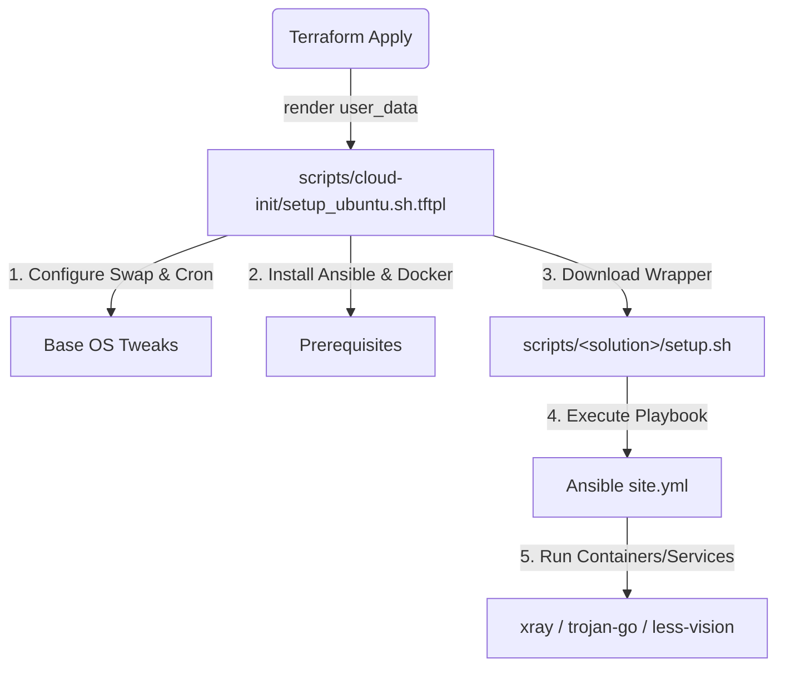

# Architecture and Resilience Guide

This document describes the high-level architecture, bootstrap flow, and built-in resilience features of the `lightsail-proxy` infrastructure.

---

## 1. Handoff & Bootstrap Architecture

The infrastructure employs a split-responsibility model: **Terraform** provisions the cloud resources, and **cloud-init** triggers a multi-stage software setup inside the VM.



### Stage 1: Cloud-Init (`setup_ubuntu.sh.tftpl`)
The entry point is `scripts/cloud-init/setup_ubuntu.sh.tftpl`. Terraform renders this script with workspace-specific variables (e.g., domain names, credentials, email) and registers it as the instance's `user_data`.
On the first boot of the VM:
1. Basic OS configuration (Swap Space, Reboot Cron Jobs) is executed.
2. Common packages (Python, Git, Docker, Ansible) are installed in a dedicated virtualenv `/opt/venv-gcp-proxy`.
3. The script detects the selected `proxy_solution` and downloads the corresponding bootstrap script (`setup.sh`) from the Git repository.

### Stage 2: Handoff & Wrapper Execution
The downloaded wrapper script (e.g., `/opt/lightsail-proxy/less-vision-reality/setup.sh`) runs. It:
1. Clones/pulls the solution repository.
2. Formats credentials and runtime variables into JSON.
3. Invokes Ansible locally (`ansible-playbook -i local ansible/site.yml`) to orchestrate container setup and configuration.

---

## 2. Resource Constraints & Resilience

The default instance type for the Lightsail proxy is `nano_2_0` (or `nano_2_1` in some regions like India). These instances are highly cost-efficient but constrained:
* **Memory**: 512 MB RAM total (approx. 451 MB usable by Linux).
* **Storage**: 20 GB SSD.

Running modern services like Docker, Containerd, Ansible, and Xray simultaneously on 512 MB of memory without precautions can trigger kernel Out-Of-Memory (OOM) events and cause the VM to freeze or hang.

To resolve and prevent these issues, the codebase includes two automated resilience features:

### A. 2GB Swap Space
A swap file is configured on the root filesystem to act as a buffer for memory spikes.
* **Size**: 2 GB (provides a total virtual memory capacity of ~2.5 GB).
* **Implementation**:
  ```bash
  if [ ! -f /swapfile ]; then
      fallocate -l 2G /swapfile
      chmod 600 /swapfile
      mkswap /swapfile
      swapon /swapfile
      echo '/swapfile none swap sw 0 0' >> /etc/fstab
  fi
  ```
* **Persistence**: Mount instructions are appended to `/etc/fstab` so the swap file is automatically mounted by systemd during every reboot.

### B. Daily Scheduled Reboot
To prevent long-term memory fragmentation, stale connections, or minor memory leaks from degrading performance, a daily cron job is configured.
* **Schedule**: 5:00 AM China Standard Time (CST), which translates to **21:00 UTC** (as VMs run on UTC by default).
* **Implementation**: A crontab file is written to `/etc/cron.d/daily-reboot`:
  ```cron
  0 21 * * * root /sbin/shutdown -r now
  ```
* **Properties**: Owned by `root:root` with `644` permissions, adhering to security guidelines. It forces a safe restart, recycling the kernel and all system services.

---

## 3. Proxy Solutions Overview

| Solution | Description | Active Services | Setup Path |
| :--- | :--- | :--- | :--- |
| `trojan-go` | Original Trojan protocol setup | Trojan-Go daemon + Nginx reverse proxy | `/opt/lightsail-proxy/trojan-go` |
| `less-vision` | Dashboard and Trojan proxy stack | Docker Compose (Xray/Caddy) | `/opt/lightsail-proxy/less-vision` |
| `less-vision-reality` | Xray VLESS-Reality proxy | Xray Docker Container | `/opt/lightsail-proxy/less-vision-reality` |
| `basic-vm` | Plain VM configuration | SSH/Mosh only (no proxy services) | N/A |
